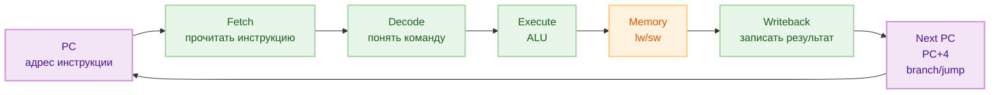
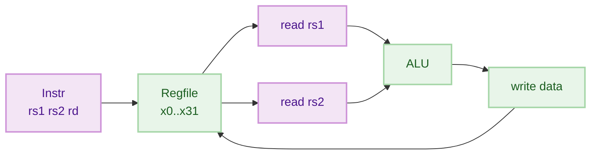
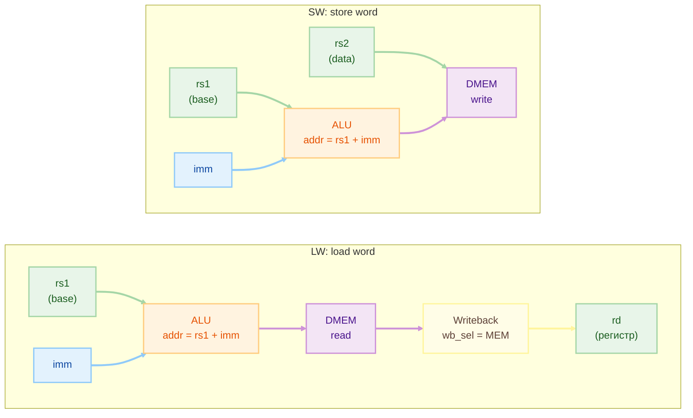
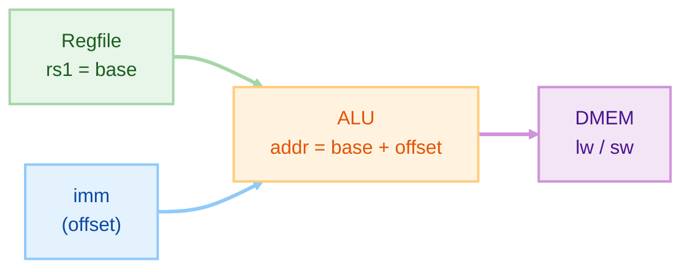

# Лекция 1 — Основы RISC-V: ISA, RV32I, регистры и память

## Цели
- только путь

## Содержание
- [1. Что такое ISA](#isa)
- [2. Что такое RV32I](#rv32i)
- [3. Из каких частей состоит простой процессор](#simple-cpu)
- [4. Как выполняется одна инструкция](#single-instr)
- [5. Регистры x0–x31 и почему x0 = 0](#regs)
- [6. Почему RISC-V — load/store](#load-store)
- [7. Адресация lw и sw](#addr-lw-sw)

<a id="isa"></a>
## 1. Что такое ISA

ISA — Instruction Set Architecture/Архитектура набора команд

ISA — это набор правил:
- какие команды бывают (add, lw, beq…)
- что каждая команда должна сделать
- какие есть регистры и как обращаться к памяти

Чтобы поддержать ISA, ваш CPU должен уметь:
- Взять инструкцию из памяти по адресу PC
- Понять команду (декодировать: что делать, какие регистры/imm)
- Выполнить действие (ALU / чтение-памяти / запись-памяти / сравнение)
- Записать результат (в регистр или в память)
- Обновить PC (обычно PC+4, либо прыжок/ветвление)


<a id="rv32i"></a>
## 2. Что такое RV32I

RISC-V появился примерно в 2010 в Калифорнийском университете в Беркли как открытая и 
минималистичная “базовая ISA + расширения”, чтобы исследователи/студенты могли 
проектировать процессоры без лицензии и с открытой спецификацией.

**RV32I** — минимальный “скелет” RISC-V для 32-битного процессора.
Этого набора хватает, чтобы: **считать**, **сравнивать**, **делать переходы** и **работать с памятью**.

- **RV** — RISC-V  
- **32** — регистры `x0..x31` по 32 бита  
- **I** — *Base Integer ISA* (базовые целочисленные команды)

**Что есть в RV32I:** 
- арифметика/логика (add/addi/and/or…)
- load/store(lw/sw)
- ветвления и прыжки (beq/jal/jalr)
- работа с непосредственным операндом immediate (imm)

**Чего нет в RV32I:** 

- умножения/деления mul/div (**расширение M**)
- плавающей точки float (**расширение F/D**)
- 16-битных инструкции (**расширение C**)

**Пример RV32I:**
инкремент значения в памяти (load → addi → store)
```asm
lw   t0, 0(sp)     # t0 = MEM[sp + 0]
addi t0, t0, 1     # t0 = t0 + 1
sw   t0, 0(sp)     # MEM[sp + 0] = t0
```

<a id="simple-cpu"></a>
## 3. Из каких частей состоит простой процессор

Минимальный CPU можно представить как набор блоков:

- **PC (Program Counter)** — хранит адрес текущей инструкции
- **Память инструкций (IMEM)** — по адресу PC отдаёт 32-битную инструкцию
- **Декодер / Control** — понимает, что за команда и какие сигналы включить
- **Регистры (Regfile x0..x31)** — быстрое “внутреннее” хранилище данных
- **ALU** — считает (сложение/логика), а также помогает с вычислением адреса для lw/sw
- **Память данных (DMEM)** — читает/пишет данные для lw/sw
- **Writeback (MUX)** — выбирает, что писать в регистр (результат ALU или данные из памяти)

<a id="single-instr"></a>
## 4. Как выполняется одна инструкция

Рассмотрим на примерах: lw / addi / sw — что делает процессор

| Инструкция | ALU | DMEM | Reg writeback |
|---|---|---|---|
| `lw`  | addr = rs1+imm | read | rd = mem |
| `addi`| rd = rs1+imm   | —    | rd = alu |
| `sw`  | addr = rs1+imm | write| — |

### 1) `lw t0, 0(sp)`  (загрузить из памяти в регистр)
- ALU считает адрес: `addr = sp + 0`
- DMEM читает: `data = MEM[addr]`
- Записать `data` в `t0`

**Control:**
- `alu_src = imm` (в ALU идёт смещение)
- `alu_op = add`  (посчитать адрес)
- `mem_read = 1`, `mem_write = 0`
- `reg_write = 1`
- `wb_sel = mem`  (в rd пишем данные из памяти)

---

### 2) `addi t0, t0, 1`  (прибавить число в регистре)
- ALU считает: `t0 = t0 + 1`
- Записать результат в `t0`

**Control:**
- `alu_src = imm`
- `alu_op = add`
- `mem_read = 0`, `mem_write = 0`
- `reg_write = 1`
- `wb_sel = alu`

---

### 3) `sw t0, 0(sp)`  (записать регистр в память)
- ALU считает адрес: `addr = sp + 0`
- DMEM пишет: `MEM[addr] = t0`

**Control:**
- `alu_src = imm`
- `alu_op = add`
- `mem_read = 0`, `mem_write = 1`
- `reg_write = 0`  (в регистры ничего не пишем)

<a id="regs"></a>
## 5. Регистры x0–x31 и почему x0 = 0

В RV32I есть **32 регистра**: `x0 … x31` (каждый по 32 бита).

Регистры — это “быстрая память” внутри процессора:
- ALU берёт операнды из регистров
- результат обычно записывается обратно в регистр

### Почему `x0` всегда равен нулю?
`x0` — это специальный регистр:
- **чтение** `x0` всегда даёт `0`
- **запись** в `x0` игнорируется (ничего не меняется)
- можно быстро получить константу 0 без отдельного блока “константа”
- можно выполнить простые вещи одной командой:
  - `addi rd, x0, imm`  → “записать число imm в rd” (если imm помещается)
  - `add rd, rs, x0`    → копирование (почти как `mv`)
  - `sw x0, 0(sp)`      → записать 0 в память



- rs1 — номер первого входного регистра (register source 1)
- rs2 — номер второго входного регистра (register source 2)
- rd — номер регистра, куда (возможно) будем записывать результат  (register destination)

**ABI** (Application Binary Interface) — это набор правил, как программы и функции используют команды и регистры

- как передаются аргументы в функцию и как возвращается результат
- кто должен сохранять регистры при вызове функции (caller/callee saved)
- как устроен стек (куда кладутся локальные переменные, куда сохраняется ra и т.п.)

| Имя (ABI) | Регистр | Описание |
|---|---:|---|
| `zero` | `x0` | всегда 0 |
| `ra`   | `x1` | адрес возврата (return address) |
| `sp`   | `x2` | указатель стека (stack pointer) |
| `t0`   | `x5` | временный регистр (temporary) |
| `a0`   | `x10`| аргумент 0 / возвращаемое значение |

<a id="load-store"></a>
## 6. Почему RISC-V — load/store

Процессор выполняет вычисления в регистрах, а с памятью работает отдельными командами.

### Правило
- **ALU работает только с регистрами**
- **память читаем/пишем только через load/store**

### Примеры
```asm
lw   t0, 0(sp)     # t0 = MEM[sp + 0]
addi t0, t0, 1     # t0 = t0 + 1
sw   t0, 0(sp)     # MEM[sp + 0] = t0
```


**LW** — из памяти в регистр, **SW** — из регистра в память

**Плюсы:**
- формат команд проще: “вычисления” и “память” разделены
- datapath проще: ALU выполняет и арифметические операции, и вычисляет адрес rs1 + imm
- легче тестировать: lw/sw — это явный интерфейс к памяти

<a id="addr-lw-sw"></a>
## 7. Адресация lw и sw

У `lw` и `sw` адрес памяти задаётся так:

**адрес = base + offset**

- **base** — это регистр (`rs1`), например `sp`
- **offset** — это маленькое число (`imm`) внутри инструкции



## Вопросы?


