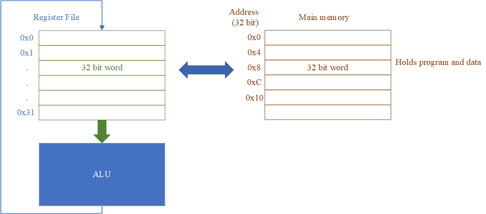

# Исполнение программы на RISC-V. Регистры и память.

---

## Содержание
<div style="font-size:20px;">

* [1. Регистры и память](#1-регистры-и-память)
* [2. Порядок байт в памяти](#2-порядок-байт-в-памяти)
* [3. Почему RISC-V — load/store архитектура](#3-почему-risc-v--loadstore-архитектура)
* [4. Адресация памяти и вычисление адреса](#4-адресация-памяти-и-вычисление-адреса)
* [5. Базовые инструкции работы с данными](#5-базовые-инструкции-работы-с-данными)
* [6. Псевдоинструкции](#6-псевдоинструкции)
* [7. Компиляция простых выражений](#7-компиляция-простых-выражений)
* [8. Как программа представлена в памяти](#8-как-программа-представлена-в-памяти)
* [9. Линейное выполнение программы и счётчик команд](#9-линейное-выполнение-программы-и-счётчик-команд)
* [10. Условные переходы](#10-условные-переходы)
* [11. Безусловный переход](#11-безусловный-переход)

</div>

---

## 1. Регистры и память

### 1.1. Регистры
<div style="font-size:24px;">

Регистры общего назначения — это небольшой набор "быстрых" ячеек хранения внутри процессора.

В RV32I их 32:

* `x0`, `x1`, ..., `x31`.

Некоторые из них имеют удобные ABI-имена:

* `zero` = `x0`
* `ra` = `x1`
* `sp` = `x2`
* `a0`–`a7` — аргументы и результаты функций
* `t0`–`t6` — временные регистры
* `s0`–`s11` — сохраняемые регистры
</div>

---

### 1.2. Память
<div style="font-size:24px;">

Память — это крупное хранилище данных и инструкций. Она медленнее регистров, но позволяет хранить значительно больше информации.

Внутри программы в памяти могут лежать:

* код программы;
* глобальные переменные;
* массивы;
* стек;
* временные данные.
</div>

---

### 1.3. Регистры и память


<div style="font-size:24px;">

* Регистровый файл – 32 регистра общего назначения
* Каждый регистр – 32 бита
* Регистр `x0` – аппаратно равен 0
* Каждая ячейка памяти – 32 бита (1 слово)
* Побайтовая адресация памяти
* Адрес 32 бита. Может быть адресовано `2^32` байт
</div>

---

## 2. Порядок байт в памяти

### 2.1. Little-endian
<div style="font-size:18px;">

```text
Word address:   0x00              0x04                 0x08                0x0C
                |                   |                   |                   |
Byte address:   00   01   02   03   04   05   06   07   08   09   0A   0B   0C   0D   0E   0F
                +----+----+----+----+----+----+----+----+----+----+----+----+----+----+----+----+
Memory byte:    | 44 | 33 | 22 | 11 | 88 | 77 | 66 | 55 | CC | BB | AA | 99 | 00 | FF | EE | DD |
                +----+----+----+----+----+----+----+----+----+----+----+----+----+----+----+----+
                  ^              ^     ^              ^     ^              ^     ^              ^
                 LSB            MSB   LSB            MSB   LSB            MSB   LSB            MSB

Words:          W0 = 0x11223344        W1 = 0x55667788        W2 = 0x99AABBCC        W3 = 0xDDEEFF00
```
</div>

### 2.2. Big-endian
<div style="font-size:18px;">

```text
Word address:   0x00              0x04                 0x08                0x0C
                |                   |                   |                   |
Byte address:   00   01   02   03   04   05   06   07   08   09   0A   0B   0C   0D   0E   0F
                +----+----+----+----+----+----+----+----+----+----+----+----+----+----+----+----+
Memory byte:    | 11 | 22 | 33 | 44 | 55 | 66 | 77 | 88 | 99 | AA | BB | CC | DD | EE | FF | 00 |
                +----+----+----+----+----+----+----+----+----+----+----+----+----+----+----+----+
                  ^              ^     ^              ^     ^              ^     ^              ^
                 MSB            LSB   MSB            LSB   MSB            LSB   MSB            LSB

Words:          W0 = 0x11223344        W1 = 0x55667788        W2 = 0x99AABBCC        W3 = 0xDDEEFF00
```
</div>

---

## 3. Почему RISC-V — load/store архитектура
<div style="font-size:24px;">

* чтение из памяти выполняется отдельными инструкциями `load`;
* запись в память выполняется отдельными инструкциями `store`;
* арифметика и логика выполняются только над регистрами.

Нельзя выполнить:

```text
MEM[A] = MEM[B] + MEM[C]
```

одной машинной инструкцией.

Необходимо разложить на шаги:

```asm
lw t0, 0(s1)
lw t1, 0(s2)
add t2, t0, t1
sw t2, 0(s3)
```
</div>

---

## 4. Адресация памяти и вычисление адреса
<div style="font-size:24px;">

Чтобы прочитать или записать данные в память, нужно указать адрес.

В RISC-V для инструкций загрузки и сохранения широко используется форма:

```asm
lw rd, imm(rs1)
sw rs2, imm(rs1)
```

Здесь адрес вычисляется как:

```text
effective_address = rs1 + imm
```

где:

* `rs1` — базовый адрес;
* `imm` — смещение.
</div>

---

### 4.1. Пример
<div style="font-size:24px;">

```asm
lw t0, 8(sp)
```

* берется значение регистра `sp`;
* к нему прибавляется 8;
* по полученному адресу прочитать слово из памяти;
* записать его в `t0`.

Такая адресация естественна для:

* доступа к локальным переменным через `sp`;
* доступа к элементам структур;
* доступа к элементам массива;
* доступа к сохранённым регистрам в стеке.

</div>

---

### 4.2. Связь с datapath
<div style="font-size:24px;">

На аппаратном уровне всё очень прозрачно:

1. значение `rs1` приходит из регистрового файла;
2. immediate извлекается и расширяется;
3. ALU складывает `rs1 + imm`;
4. полученный адрес идёт в память или в LSU.
</div>

---

## 5. Базовые инструкции работы с данными
<div style="font-size:17px;">

### 5.1. Загрузка из памяти в RV32I

* `lw` — загрузить слово;
* `lh` — загрузить полуслово со знаковым расширением;
* `lhu` — загрузить полуслово с нулевым расширением;
* `lb` — загрузить байт со знаковым расширением;
* `lbu` — загрузить байт с нулевым расширением.

Пример:

```asm
lw t0, 0(s0)
```

### 5.2. Сохранение в память RV32I

* `sw` — сохранить слово;
* `sh` — сохранить полуслово;
* `sb` — сохранить байт.

Пример:

```asm
sw t0, 12(sp)
```

</div>

---

## 6. Псевдоинструкции
<div style="font-size:20px;">

Команды, которые есть в ассемблере, но их нет как отдельных инструкций ISA, называются **псевдоинструкциями**.

Ассемблер принимает их для удобства, а затем разворачивает в одну или несколько настоящих инструкций.

### Примеры

| Псевдоинструкция | Разворачивается в | Описание |
|---|---|---|
| `mv t0, t1` | `addi t0, t1, 0` | копирование регистра |
| `nop` | `addi x0, x0, 0` | ничего не делает |
| `j loop` | `jal x0, loop` | безусловный переход |
| `ret` | `jalr x0, 0(ra)` | возврат из функции |
| `li t0, 5` | `addi t0, x0, 5` | загрузка малой константы |
| `li t0, big_imm` | `lui` + `addi` | загрузка большой константы |
</div>

---

## 7. Компиляция простых выражений

Компилятор раскладывает выражение на простые операции: загрузка, вычисление, сохранение.

<table>
<tr>
<td style="width:10%; vertical-align:top;">

<div style="font-size:20px;">

| C-код | RISC-V |
|---|---|
| `c = a + b;` | `add t0, t1, t2` |
| `y = a + 5;` | `addi t0, t1, 5` |
| `d = (a + b) - c;` | `add t0, t1, t2`<br>`sub t3, t0, t4` |
| `c = a + b;`<br>*(`a`, `b`, `c` в памяти)* | `lw t0, 0(s0)`<br>`lw t1, 4(s0)`<br>`add t2, t0, t1`<br>`sw t2, 8(s0)` |

</div>

</td>
<td style="width:32%; vertical-align:top; padding-left:22px;">

<div style="font-size:22px;">

если данные в памяти — нужны `lw/sw`

арифметика выполняется **над регистрами**, а не над памятью

одно и то же выражение может компилироваться по-разному в зависимости от того, где лежат операнды:

* в регистрах
* в стеке
* в памяти

компилятор старается держать данные в регистрах, потому что обращение к памяти дороже

</div>

</td>
</tr>
</table>

---

## 8. Как программа представлена в памяти

```text
+----------------------+----------------------+------------------------------------------------------------------+
| 1) Assembly          | 2) Machine code      | 3) Code in memory (little-endian)                                |
+----------------------+----------------------+------------------------------------------------------------------+
| start:               |                      | PC        Addr     Bytes              Instruction                 |
|   addi t0, x0, 5     | 0x00500293           | ->        0x0000   93 02 50 00        addi t0, x0, 5             |
|   addi t1, x0, 7     | 0x00700313           |           0x0004   13 03 70 00        addi t1, x0, 7             |
|   add  t2, t0, t1    | 0x006283B3           |           0x0008   B3 83 62 00        add  t2, t0, t1            |
|   sw   t2, 0(s0)     | 0x00742023           |           0x000C   23 20 74 00        sw   t2, 0(s0)             |
+----------------------+----------------------+------------------------------------------------------------------+

Example:
0x00500293  ->  93 02 50 00   in memory
               ^ lowest address
Execution:
PC_next = PC + 4
PC = 0x0000 -> 0x0004 -> 0x0008 -> 0x000C -> 0x0010

Rule:
PC_next = PC + 4
```

---

## 8. Как программа представлена в памяти (продолжение)

<div style="font-size:20px;">
Обычно память разделяют на логические области:

* `.text` — машинный код программы;
* `.data` — инициализированные глобальные данные;
* `.bss` — неинициализированные глобальные данные;
* `stack` — стек;
* иногда отдельно обсуждают `heap` — динамическую память.

### Упрощённая схема

```text
+-----------------------+
|        .text          |  код программы
+-----------------------+
|        .data          |  глобальные переменные
+-----------------------+
|        .bss           |  глобальные нули/буферы
+-----------------------+
|         ...           |
+-----------------------+
|       stack           |  локальные данные, сохранённые регистры
|      растёт вниз      |
+-----------------------+
```
</div>

---

## 8. Как программа представлена в памяти (продолжение 2)
<div style="font-size:20px;">

`.text`  
В секции `.text` находятся инструкции. Именно туда указывает `PC`.

`.data`  
Например:

```c
int g = 10;
int arr[4] = {1, 2, 3, 4};
```

Эти данные должны быть где-то размещены в памяти, чтобы программа могла к ним обращаться.

`.stack`  
Когда функция начинает выполняться, она часто выделяет место на стеке для:
* локальных переменных;
* сохранённых регистров;
* адреса возврата;
* временных данных.
</div>

---

## 9. Линейное выполнение программы и счётчик команд

Инструкции в программе обычно исполняются последовательно.

За это отвечает **счётчик команд** — `PC` (Program Counter), который хранит адрес текущей инструкции.

В простейшем случае после выполнения инструкции:

```text
PC = PC + 4
```

так как в RV32I инструкции имеют длину 32 бита, то есть 4 байта.

---

### 9.1. Линейная программа
<div style="font-size:20px;">

Пример:

```asm
addi t0, x0, 5
addi t1, x0, 7
add  t2, t0, t1
sw   t2, 0(s0)
```

1. `PC` указывает на первую команду;
2. она выполняется;
3. `PC` увеличивается на 4;
4. выполняется следующая команда;
5. и так далее.

На аппаратном уровне должен существовать путь:

* либо `PC + 4`;
* либо новый адрес перехода/ветвления.

Значит, нужен механизм выбора следующего значения `PC`. Обычно это мультиплексор на входе регистра `PC`.
</div>

---

## 10. Условные переходы
<div style="font-size:20px;">

Если бы программа всегда шла только по схеме `PC = PC + 4`, невозможно было бы реализовать:

* `if`;
* `while`;
* `for`;
* вызовы функций;
* возврат из функций.

Поэтому нужны команды, которые умеют менять линейный ход исполнения программы.

### Основные ветвления RV32I

* `beq rs1, rs2, label` — перейти, если равны;
* `bne rs1, rs2, label` — перейти, если не равны;
* `blt rs1, rs2, label` — перейти, если `rs1 < rs2`;
* `bge rs1, rs2, label` — перейти, если `rs1 >= rs2`;
* `bltu`, `bgeu` — беззнаковые варианты.

</div>

---

### 10.1. Пример работы условного перехода

`beq t0, t1, equal_case`

<div style="font-size:20px;">

```text
                           Instruction memory

   0x0000   +-----------------------------+   addi t0, x0, 5
   0x0004   +-----------------------------+   addi t1, x0, 5
PC 0x0008   +-----------------------------+   beq  t0, t1, equal_case
   0x000C   +-----------------------------+   addi t2, x0, 0
   0x0010   +-----------------------------+   equal_case: addi t2, x0, 1

                    t0 --------\
                                 > compare (==) ---- branch_taken
                    t1 --------/

          PC + 4 -----------------------------------\
                                                     > next PC
          branch target = PC + immediate -----------/

If t0 == t1:
    PC : 0x0008 -> 0x0010

If t0 != t1:
    PC : 0x0008 -> 0x000C
```
</div>

---

## 11. Безусловный переход

Для безусловного перехода `j skip` часто пишут:

```asm
j loop
```

Это псевдоинструкция и разворачивается в:

```asm
jal x0, loop
```

```text
                           Instruction memory

   0x0000   +-----------------------------+   addi t0, x0, 5
PC 0x0004   +-----------------------------+   j skip
   0x0008   +-----------------------------+   addi t1, x0, 1
   0x000C   +-----------------------------+   skip: addi t1, x0, 2
```
